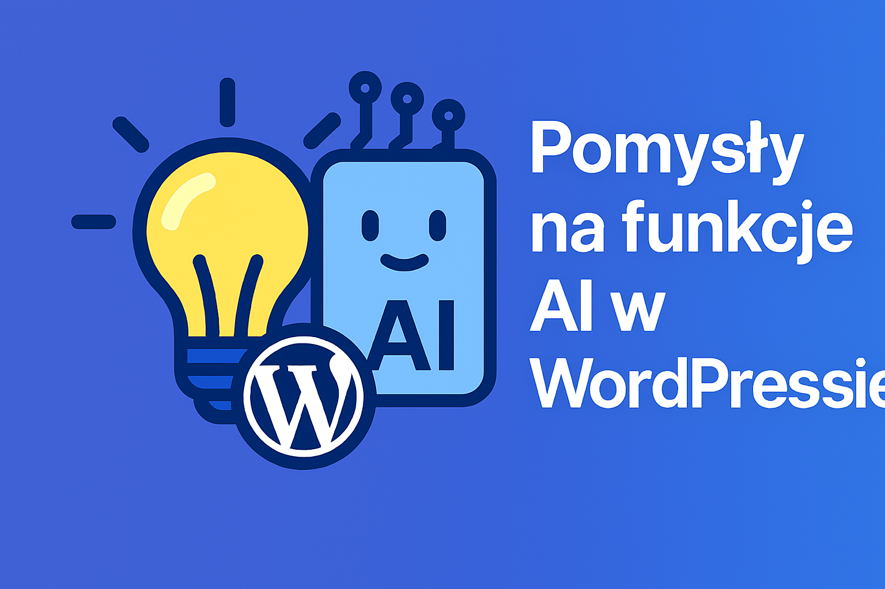

# 💡 Copilot for WordPress — pomysły i rozwój

Hej! 👋  
To repozytorium jest przestrzenią do dzielenia się pomysłami i współpracy nad wtyczką **Copilot for WordPress**, która wniesie **inteligentne funkcje AI** bezpośrednio do Twojej strony lub bloga.

---

## ✨ Czego szukamy
- Funkcje ułatwiające **tworzenie i edycję treści**
- Integracje AI wspierające **SEO**, **tłumaczenia** i **analizę obrazów**
- Kreatywne scenariusze użycia **głosu** i **Vision** w WordPressie

---

## 🧠 Inspiracje
*(możesz dodać własne)*

- Generator wpisów blogowych na podstawie krótkiego opisu  
- Automatyczne tworzenie **alt‑tekstów** dla obrazów  
- Podpowiedzi słów kluczowych do SEO w czasie rzeczywistym  
- Tłumaczenie wpisów na wiele języków jednym kliknięciem  
- Tryb „asystenta” w Gutenbergu, który prowadzi krok po kroku  
- **AI‑asystent w komentarzach** – podpowiada spersonalizowane odpowiedzi  
- **Analiza nastroju wpisu** – ocenia ton i sugeruje zmiany w stylu  
- **Planer publikacji oparty na trendach** – podpowiada, kiedy i o czym pisać  
- **Generator cytatów i call‑to‑action** – dodaje inspirujące wstawki  
- **Automatyczne streszczenia** – tworzy teasery do social mediów lub newslettera

---

## 📌 Jak zgłosić pomysł
Dodaj komentarz poniżej i opisz:  
1. **Co ma robić funkcja**  
2. **Dlaczego jest przydatna**  
3. *(Opcjonalnie)* Jak to mogłoby działać w praktyce  

Każdy pomysł jest mile widziany! 🚀

---

## 🔜 Roadmap
- [ ] Pierwsza wersja szkieletu wtyczki (PHP)  
- [ ] Integracja z API Copilot  
- [ ] Moduł generatora wpisów  
- [ ] Funkcje SEO i tłumaczeń  
- [ ] Integracja Vision i analizy obrazów

---

## 🔖 Tagi
`idea` `help wanted`

---

## 📄 Licencja
Projekt dostępny na licencji **GPL v2** lub nowszej.
